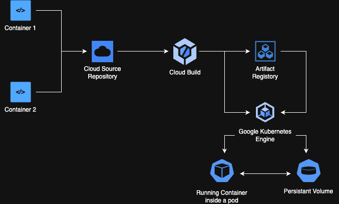

# Kubernetes-Based Multi-Container Application

This project demonstrates a Kubernetes-based multi-container application deployed on Google Kubernetes Engine (GKE). The application consists of two containers (`container1` and `container2`) that communicate with each other to process and analyze CSV files stored in a shared Persistent Volume (PV).

## Table of Contents
- [Overview](#overview)
- [Architecture](#architecture)
- [Components](#components)
- [Workflow](#workflow)
- [Setup and Deployment](#setup-and-deployment)
- [Usage](#usage)
- [Diagrams](#diagrams)
- [Technologies Used](#technologies-used)
- [License](#license)

---

## Overview

The application is designed to:
1. Allow users to upload and store CSV files in a shared Persistent Volume.
2. Process the uploaded files to calculate the sum of specific product amounts.
3. Utilize two containers:
   - **Container 1**: Handles file uploads and forwards processing requests to Container 2.
   - **Container 2**: Processes the CSV files and returns the results.

---

## Architecture

The architecture consists of the following components:
1. **Google Kubernetes Engine (GKE)**: Hosts the Kubernetes cluster.
2. **Persistent Volume (PV)**: Shared storage for both containers.
3. **Container 1**: Exposes an API for file uploads and forwards processing requests to Container 2.
4. **Container 2**: Processes CSV files and calculates the sum of product amounts.

### Architecture Diagram

Below is the architecture diagram for the project:



---

## Components

### 1. **Container 1**
- **Purpose**: Handles file uploads and forwards processing requests to Container 2.
- **Endpoints**:
  - `/store-file`: Stores a file in the shared Persistent Volume.
  - `/calculate`: Forwards file processing requests to Container 2.

### 2. **Container 2**
- **Purpose**: Processes CSV files and calculates the sum of product amounts.
- **Endpoints**:
  - `/process`: Processes the CSV file and returns the sum of the specified product amounts.

### 3. **Persistent Volume**
- Shared storage between Container 1 and Container 2.
- Configured using Kubernetes Persistent Volume Claim (PVC).

---

## Workflow

The project workflow involves the interaction between two containers (`Container 1` and `Container 2`) and a shared Persistent Volume (PV). Below is a step-by-step explanation of how the system operates:

1. **File Upload**:
   - The user uploads a CSV file to the application via an API endpoint exposed by **Container 1** (`/store-file`).
   - **Container 1** saves the uploaded file to the shared Persistent Volume (PV), making it accessible to both containers.

2. **Processing Request**:
   - The user sends a request to process the uploaded file via another API endpoint exposed by **Container 1** (`/calculate`).
   - The request specifies the file name and the product for which the sum of amounts needs to be calculated.

3. **Forwarding the Request**:
   - **Container 1** forwards the processing request to **Container 2** via its `/process` endpoint.
   - The request includes the file name and the product to be processed.

4. **File Processing**:
   - **Container 2** accesses the shared Persistent Volume (PV) to read the specified CSV file.
   - It processes the file to calculate the sum of the amounts for the specified product.

5. **Returning the Result**:
   - **Container 2** sends the calculated result back to **Container 1**.
   - **Container 1** then returns the result to the user as the response to the `/calculate` API request.

### Example Workflow

1. **User Action**: Upload a file named `example.csv` with the following content:
   ```csv
   product,amount
   A,10
   B,20
   A,15
